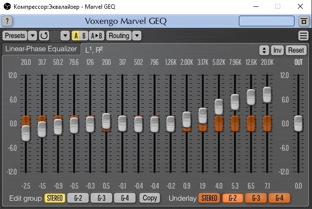

# Настройки OBS Studio

Свободная программа с открытым исходным кодом для записи видео и потокового вещания, разрабатываемая проектом OBS и сообществом независимых разработчиков.

[Сайт](https://obsproject.com/ru)

## Настройки
**Вывод | Запись**

**Вывод | Аудио**

**Видео**

**Горячие клавиши**

**Расширенные**

## Сцена 1 (рабочий стол)
**Источники:**
- рабочий стол

*Микшер аудио:*
- микрофон

*Расширенные свойства аудио*
- дорожка 1
  
*Фильтры*
- шумоподавление ( RNNnoise )
- компрессор ( 10.00:1 | -18.00 dB | 6 ms | 60 ms | 0.00 dB | Нет )
- эквалайзер ( [VST Marvel GEQ](https://www.voxengo.com/product/marvelgeq/) )

- усиление ( 18.00 dB )
- лимитер ( -1.00 dB | 60 ms )

## Сцена 2 (вебкамера)

**Источники:**
- Вебкамера
  
*Фильтры*
- Маска изображения / Смешивание

- Применить LUT

- Коррекция цвета

### Контакты

